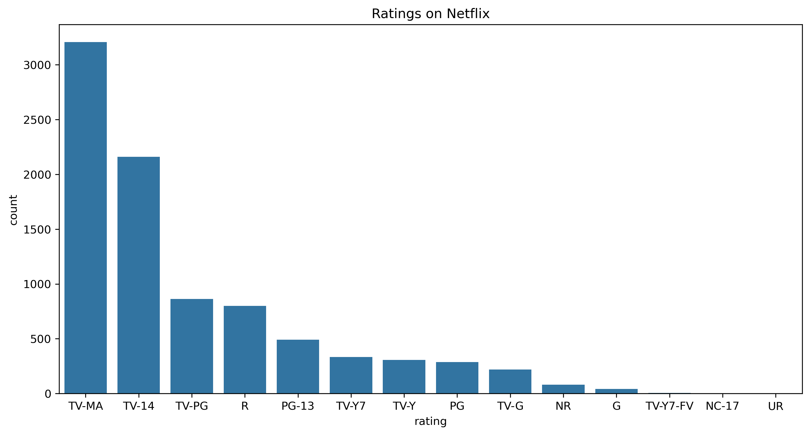
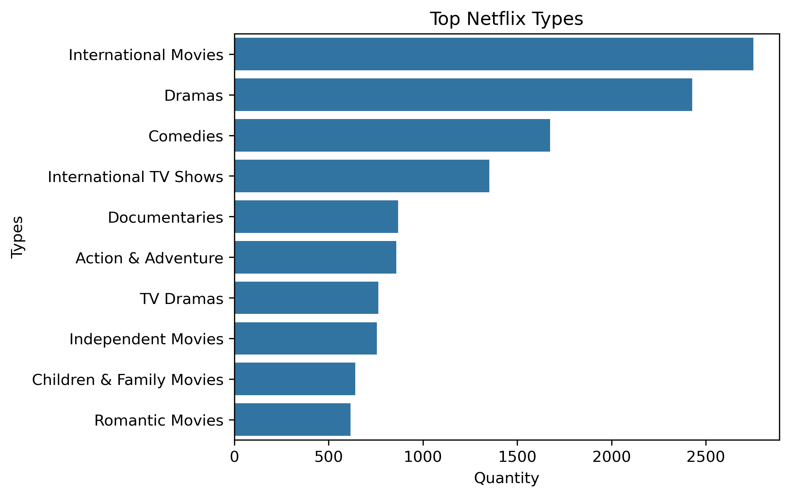
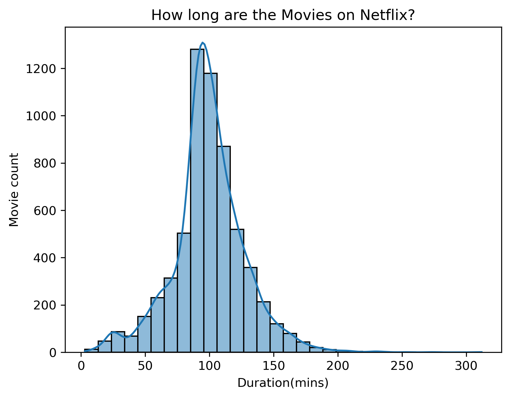

# Netflix Content Strategy Analysis

## Project Overview
This project explores the Netflix dataset to understand the platform's content strategy. I analyzed the evolution of content over time, the balance between Movies and TV Shows, and the geographical distribution of productions.

**Key Question:** How has Netflix's library evolved, and what are the dominant characteristics of it?

## Tools & Technologies
* **Python** (Pandas, Matplotlib, Seaborn)
* **Techniques:** Data Cleaning (handling missing values), String Manipulation, Time Series Analysis.

## Key Insights

### 1. Audience Segmentation
The platform's primary target is the adult and young adult market. **TV-MA** (Mature) and **TV-14** are the two most common age ratings, indicating a strategy focused on mature, non-family content.

### 2. Exponential Growth
The platform saw massive exponential growth starting around **2015/2016**, coinciding with its global expansion strategy.

### 3. Global Content Dominance
After analyzing individual genres, the results confirm Netflix's global strategy.
* **International Movies** and **Dramas** are the most common types of content.
* This highlights aggressive investment in non-US productions, supporting the platform's worldwide expansion.

### 4. Movie Duration Standard
The distribution of movie runtimes is concentrated around the industry standard. The highest volume of films falls between **90 and 100 minutes**, with an average duration of approximately **99.56 minutes**.

## Conclusion
Netflix successfully transitioned into a global content powerhouse, specializing in mature, international dramas and feature-length films (around 100 minutes), which is vital for retaining subscription audiences.
